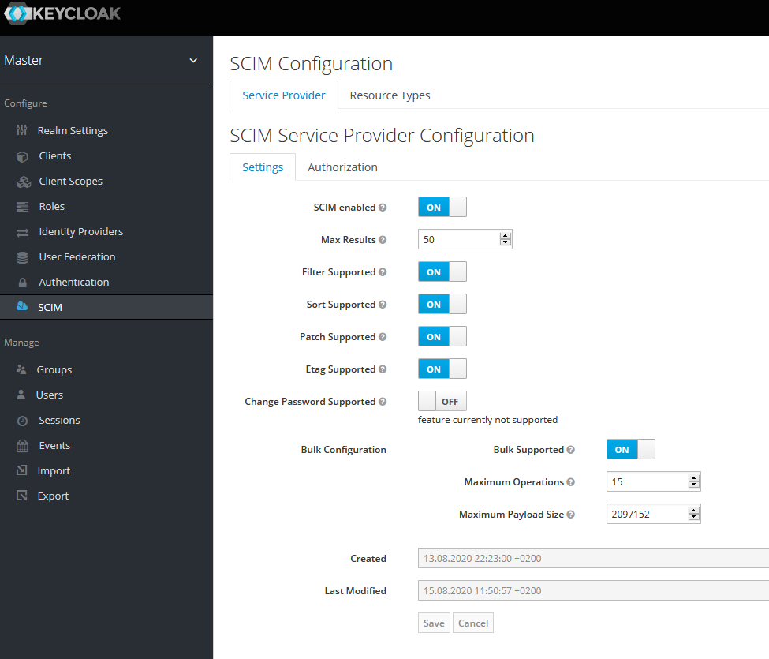

# What is SCIM-for-keycloak?

It is a full fleshed SCIM implementation that is easily integrated into keycloak and is also easily configurable
within the web admin console. You'll be able to restrict access of endpoints with roles and to specific clients
. Select the option `scim` on entry `Admin Console Theme` and reload the page (Press F5).

## Deploy into a standalone keycloak server?

Switch into the parent directory "SCIM-SDK" and build the project once with `mvn package -DskipTests`.
Copy the file `SCIM-SDK/scim-for-keycloak/scim-for-keycloak-deployment/target/scim-for-keycloak.ear` into the
directory `${keycloak.home}/standalone/deployments` of a keycloak server.  
**NOTE:** *If the server is running during deployment you need to restart it!*

## build a docker image with scim-for-keycloak deployed

Execute `mvn clean package -P docker -DskipTests`. The build will create a docker image and installs it into your local
docker registry with the name `scim-for-keycloak-${project.version}`.  
This docker-image requires a mariadb database with username "root" and password "123456". This can easily be changed
by manipulating the `Dockerfile` in
`SCIM-SDK/scim-for-keycloak/scim-for-keycloak-deployment/src/main/docker/Dockerfile`. Simply execute the maven profile
again after manipulating the Dockerfile with `mvn clean package -P docker -DskipTests`

**NOTE:** *If the build with `mvn clean package -P docker -DskipTests` does not work please execute it from the
parent-directory `SCIM-SDK`*

After the image has been pushed into your local registry you can start a fast setup with the docker-compose file in
directory `SCIM-SDK/scim-for-keycloak/docker-compose` with the command 
`docker-compose -p scim-for-keycloak up`. Please note that docker might ask you to share the directory because the
 file `wait-for-it.sh` - that ensures successful starting of the containers - is mounted into the keycloak-container.

## How do I configure the SCIM endpoints?

1. Deploy the `scim-for-keycloak.ear` file into your server. If the server is currently running you need to restart it!
2. Now open the web admin console of keycloak open the realm settings and select the `Themes` tab and select the `scim`
 theme for the admin console. Now reload the browser page and the `SCIM` menu link should be visible. 
  

## What is configurable?

1. Select the `SCIM` link and you should see the following view:   
  
2. You can disable SCIM for each realm separately and the `ServiceProvider` configurations as defined in RFC7643
3. You may restrict access to the SCIM-endpoints for each separate realm by allowing users only access if they have
 been identified by a specific client. If no clients are selected any client is authorized to access the SCIM
 endpoints:  
  
4. You get an overview for all registered `ResourceTypes` and may configure them separately.  
    
You may have noticed that a 3rd `ResourceType` with name `RealmRole` is present that is not defined by RFC7643. This
`ResourceType` is a custom endpoint that acts as showcase to demonstrate how easy it is to extend the API with new
endpoints. This endpoint provides support for adding new `RealmRoles` and associate them with either `Groups` or
`Users`.
5. Each endpoint provides several settings that can be configured:  
    
  You'll be able to change the description of an endpoint, disable a specific `ResourceType` or just prevent that new
  resources are created, deleted, updated or read.
6. You can turn off the requirement for authentication on each `ResourceType` but not for specific 
`ResourceType`-endpoints.
7. You'll be able to set required roles for each `ResourceType` and each `ResourceType`-endpoint [create, get
, list, update, delete]  
    
  The role settings are of course only respected if authentication is enabled.  
   
## Disadvantages

I didn't find a really good way in storing multi-valued-complex structures in the user-attributes table so I stored
such data structures in pure json in this table. Please note that the values in the screenshot are simply 
auto-generated test-values. 
  
